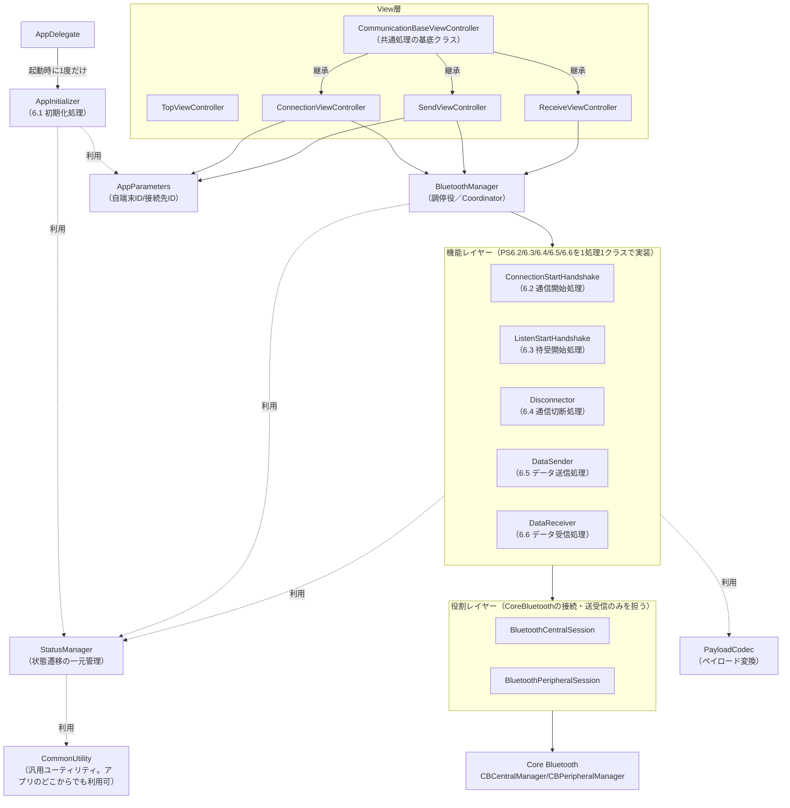
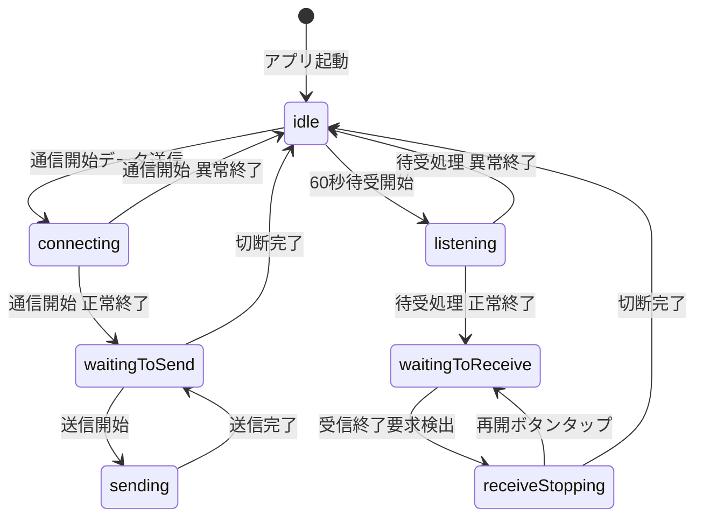
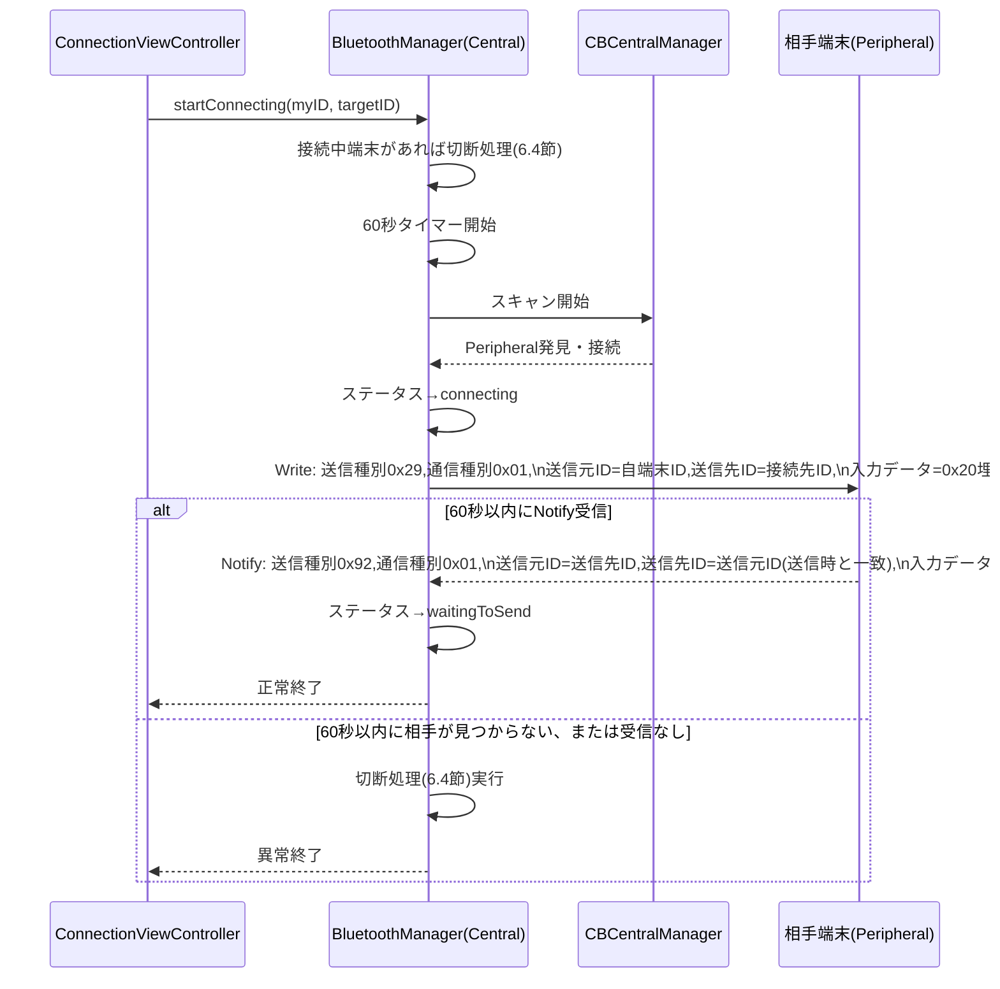
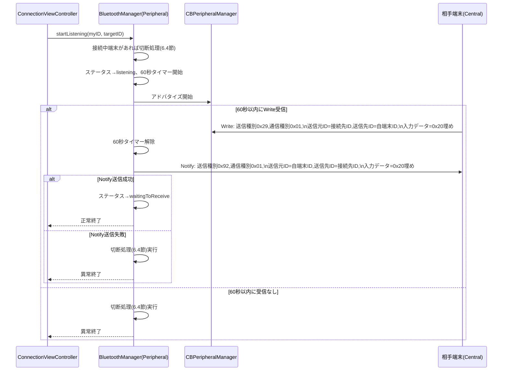
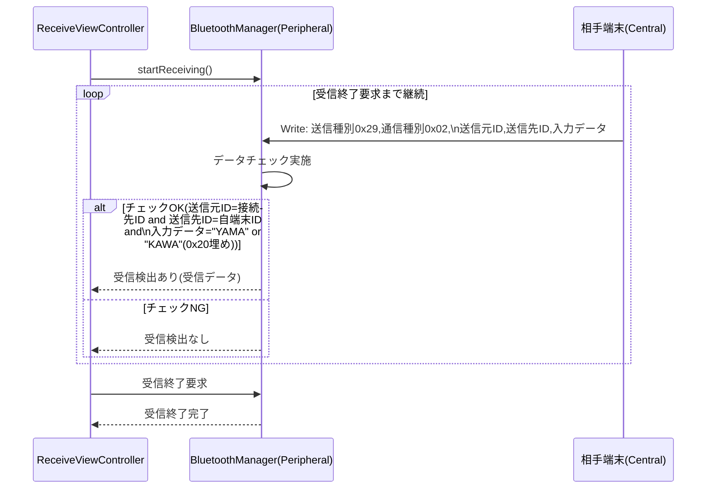

# PS設計書（プログラム仕様書）

## 改訂履歴

| 版数 | 日付 | 内容 |
|---|---|---|
| 1.0 | 2026-08-13 | 初版作成 |
| 1.1 | 2026-08-14 | 6.2/6.3のタイムアウトを30秒→60秒に変更（処理開始＝ボタン押下の瞬間から起算するよう修正）。初期化処理（6.1）を`AppInitializer`、通信切断処理（6.4）を`Disconnector`として機能単位化し、1章・8章・6.1・6.4に反映。「切断処理」章番号の誤記（7章）を6.4節へ修正 |
| 1.2 | 2026-08-15 | 8章のクラス構成表で`DataSender`行が重複していたのを修正（1行に統合） |
| 1.3 | 2026-08-15 | Bluetooth通信に関わる画面の共通処理を`CommunicationBaseViewController`に集約。1章・8章に反映 |
| 1.4 | 2026-08-15 | アプリ全体で使う汎用ユーティリティ（アサート等）を`CommonUtility`として追加し、1章・8章に反映。`StatusManager.apply`のアサート呼び出しを`CommonUtility.assert`経由に変更 |
| 1.5 | 2026-08-15 | データ送信画面の「戻る」ボタン処理が、予期しない切断検知処理と別々の判定だった点を修正。`CommunicationBaseViewController`共通の排他制御（`beginHandlingCommunicationEnd()`）に参加させ、両者が同時に走らないようにした（動作仕様自体に変更はなし） |
| 1.6 | 2026-08-15 | `CommonUtility`の配置先を`Sources/Managers/`から`Sources/Common/`へ変更（コーディング規約3.1改訂に伴う。クラス設計・呼び出し方に変更はなし） |
| 1.7 | 2026-08-15 | `CommonUtility.assert`の`condition`引数を`@autoclosure`化。Releaseビルドで条件式が評価されないよう、Swift標準の`assert`と同じ挙動に修正（呼び出し元のコードに変更はなし） |

## 0. 本書について

本書は Sample App のプログラム内部仕様を定義する。内部パラメータ、状態遷移、Bluetooth通信フォーマット、Core Bluetoothを用いた通信処理の詳細フローを記載する。画面仕様は「SS設計書」、画面レイアウトは「UI設計書」を参照すること。

### 0.1 前提・設計上の補足事項

要件定義書には明記されていないが、実装のために本書で以下の設計判断を行う。

| No | 項目 | 設計判断 | 理由 |
|---|---|---|---|
| 1 | 通信ライブラリ | 通信には**Core Bluetooth**を使用する | BLE(Bluetooth Low Energy)のみを使用し、Wi-Fiハードウェアには関与しない |
| 2 | ID→ペイロード変換 | 自端末ID／接続先ID（3桁の数値文字列 `000`〜`999`）をASCII変換し、3byteのバイナリとして格納する | — |
| 3 | Central/Peripheral役割 | 「接続開始」ボタン操作端末＝**Central**、「待受開始」ボタン操作端末＝**Peripheral** | Bluetooth通信開始処理（能動的に探索・接続・送信する側）とBluetooth待受開始処理（受動的に待ち受ける側）の役割がCore BluetoothのCentral/Peripheralモデルと自然に対応するため |
| 4 | GATT通信方向 | Central→Peripheralへの送信はWrite特性、Peripheral→Centralへの送信はNotify特性を用いる（片方向2特性構成） | 要件上、双方向で送信が発生するのは「5.Bluetooth通信開始処理」「6.Bluetooth待受開始処理」のハンドシェイクのみであり、データ受信処理側からの応答送信は不要なため、2特性で全シナリオを表現できる |
| 5 | 送信サイズ確認 | 書込み前に`peripheral.maximumWriteValueLength(for:)`を確認し、18byte以上であることを確認した上で`writeValue(_:for:type:)`を1回実行する（分割送信は行わない） | ペイロード18byteは固定長であり、MTU確認により1回の書込みで送信可能なため |

## 1. アーキテクチャ概要

| コンポーネント | 責務 |
|---|---|
| `AppInitializer` | 初期化処理（6.1）専用。アプリ起動時に`AppDelegate`から1度だけ呼ばれる。実処理は持たず、`StatusManager`／`AppParameters`が提供するAPIを呼び出すだけにとどめる |
| `AppParameters` | 内部パラメータ「自端末ID」「接続先ID」の保持・永続化 |
| `StatusManager` | 状態遷移の一元管理（3.2の遷移テーブルを保持し、`AppStatusTransitionEvent`経由でのみ遷移させる） |
| `PayloadCodec` | 18byteペイロードのエンコード／デコード（ID⇔ASCII変換、パディング処理を含む） |
| `CommonUtility` | アプリ全体のどこからでも呼び出せる汎用ユーティリティ（アサート等）。継承を使わず`enum`＋`static func`で提供する |
| `BluetoothCentralSession` | Central役の役割レイヤー。Core Bluetooth（0.1 No.1の通信ライブラリ）の接続確立・GATT探索・Write/Notify送受信APIを呼び出すだけで、4章のペイロードフォーマット（送信種別・通信種別・ID・入力データの意味）は解釈しない |
| `BluetoothPeripheralSession` | Peripheral役の役割レイヤー。Core Bluetoothのアドバタイズ・GATTサーバー提供・Write受信/Notify送信APIを呼び出すだけで、4章のペイロードフォーマットは解釈しない |
| `ConnectionStartHandshake` | 通信開始処理（6.2）専用。`BluetoothCentralSession`を介して要求送信・応答待受を行う |
| `ListenStartHandshake` | 待受開始処理（6.3）専用。`BluetoothPeripheralSession`を介して要求待受・応答送信を行う |
| `Disconnector` | 通信切断処理（6.4）専用。渡されたセッションのteardownと、アイドル状態への遷移を行う |
| `DataSender` | データ送信処理（6.5）専用。`BluetoothCentralSession`を介してデータを送信する |
| `DataReceiver` | データ受信処理（6.6）専用。`BluetoothPeripheralSession`のWrite受信窓口を介してデータチェックを行う |
| `BluetoothManager` | 上記の役割/機能クラスを、現在の役割（Central/Peripheral）に応じて生成・接続・破棄するだけの調停役（Coordinator）。4章のペイロードフォーマットの意味は持たない |
| `CommunicationBaseViewController` | Bluetooth通信に関わる画面（`ConnectionViewController`／`SendViewController`／`ReceiveViewController`）が共通で継承する基底クラス。単純なメッセージダイアログ表示（`presentAlert(message:)`）と、予期しない切断検知時の共通フロー（要件定義書12.2）を集約する |
| 各`ViewController` | 画面表示・ユーザー操作の受付・`BluetoothManager`/`AppParameters`の呼び出し |

## 2. 内部パラメータ

| パラメータ名 | 型 | 初期値 | 入力範囲 | 説明 |
|---|---|---|---|---|
| 自端末ID | 数値文字列(3桁) | `"000"` | `"000"`〜`"999"` | 自端末を識別するID |
| 接続先ID | 数値文字列(3桁) | `"001"` | `"000"`〜`"999"` | 通信相手を識別するID |

初期値は「10.初期化処理」にてアプリ起動時に1度だけセットする。

## 3. ステータス（状態）仕様

### 3.1 状態一覧

| No | 状態名（和名） | 識別子（案） |
|---|---|---|
| 1 | アイドル | `idle` |
| 2 | Bluetooth通信開始処理中 | `connecting` |
| 3 | データ送信待ち中 | `waitingToSend` |
| 4 | Bluetooth通信待受処理中 | `listening` |
| 5 | データ受信待ち中 | `waitingToReceive` |
| 6 | データ受信停止中 | `receiveStopping` |
| 7 | データ送信処理中 | `sending` |

### 3.2 状態遷移契機一覧

| No | 遷移先状態 | 遷移契機 |
|---|---|---|
| 1 | アイドル | アプリ起動時 |
| 2 | アイドル | Bluetooth通信切断処理完了後 |
| 3 | Bluetooth通信開始処理中 | Bluetooth通信開始処理にて、通信開始のデータ送信時 |
| 4 | データ送信待ち中 | Bluetooth通信開始処理にて、コール元に正常終了を通知する時 |
| 5 | データ送信待ち中 | データ送信処理にて、データ送信完了時 |
| 6 | Bluetooth通信待受処理中 | Bluetooth通信待受処理にて、60秒間のデータ待受開始時 |
| 7 | データ受信待ち中 | Bluetooth通信待受処理にて、コール元に正常終了を通知する時 |
| 8 | データ受信待ち中 | データ受信画面にて、「再開」ボタンをタップしてデータ受信処理を開始した時 |
| 9 | データ受信停止中 | データ受信処理が「受信終了要求」を検出して、コール元に「受信終了完了」を通知する時 |
| 10 | データ送信処理中 | データ送信処理にて、データ送信開始時 |

### 3.3 状態遷移図

> 補足: `connecting → idle` および `listening → idle` の異常終了時の遷移は、いずれもBluetooth通信切断処理（6.4節）を経由する。

## 4. 通信フォーマット仕様

### 4.1 ペイロード構成（全18byte固定長）

| オフセット | 項目 | サイズ | 内容 |
|---|---|---|---|
| 0 | 送信種別 | 1byte | 要求時`0x29` / 応答時`0x92` |
| 1 | 通信種別 | 1byte | 通信開始・待受`0x01` / データ送受信`0x02` |
| 2〜4 | 送信元ID | 3byte | 送信元の端末IDをASCII変換した値 |
| 5〜7 | 送信先ID | 3byte | 送信先の端末IDをASCII変換した値 |
| 8〜17 | 入力データ | 10byte | バイナリデータ（詳細は用途毎に4.4参照） |

### 4.2 送信種別コード

| コード | 意味 |
|---|---|
| `0x29` | 要求 |
| `0x92` | 応答 |

### 4.3 通信種別コード

| コード | 意味 |
|---|---|
| `0x01` | Bluetooth通信開始・待受 |
| `0x02` | データ送受信 |

### 4.4 ID変換仕様

自端末ID／接続先ID（画面入力値、3桁数値文字列 `"000"`〜`"999"`）を、ASCII(0x30〜0x39)にエンコードし、3byteのバイナリとする。

### 4.5 入力データ領域（10byte）の用途別内容

| 用途 | 内容 |
|---|---|
| 通信開始要求／応答（通信種別`0x01`） | 全10byteを`0x20`（半角スペース）で埋める |
| データ送信（通信種別`0x02`、送信種別`0x29`） | データ送信画面で選択した文字列（`"YAMA"` or `"KAWA"`）をASCII変換し、残りのbyteを`0x20`で埋める |
| データ受信チェック対象（通信種別`0x02`、送信種別`0x29`） | ASCII文字列 `"YAMA"` または `"KAWA"`（残りは`0x20`埋め）であることをチェックする |

## 5. Core Bluetooth設計

### 5.1 Central/Peripheral役割

| 操作 | 役割 | 使用するマネージャ |
|---|---|---|
| 「接続開始」ボタン（Bluetooth通信開始処理） | Central | `CBCentralManager` |
| 「待受開始」ボタン（Bluetooth待受開始処理） | Peripheral | `CBPeripheralManager` |

本アプリは1:1通信であり、接続後は同一セッション内でCentral側が「データ送信画面」、Peripheral側が「データ受信画面」に遷移する。役割はアプリ起動中固定ではなく、ユーザーがどちらのボタンを押したかによって都度決定される。

### 5.2 GATTプロファイル定義

| 項目 | UUID（暫定値） | Properties | Permissions |
|---|---|---|---|
| Service | `00000000-0000-0000-0000-000000000001` | - | - |
| Request/Dataキャラクタリスティック（Central→Peripheral） | `00000000-0000-0000-0000-000000000002` | Write | Writeable |
| Responseキャラクタリスティック（Peripheral→Central） | `00000000-0000-0000-0000-000000000003` | Notify | - |

- **Request/Dataキャラクタリスティック**: Centralが「通信開始要求」（通信種別`0x01`）および「データ送信」（通信種別`0x02`）の18byteペイロードを書き込む。
- **Responseキャラクタリスティック**: Peripheralが「通信開始応答」（送信種別`0x92`、通信種別`0x01`）の18byteペイロードをNotifyで通知する。データ受信処理（9章）では応答送信は行わない。

> UUIDは暫定値。実装時に本書のUUIDをソースコードの定数として使用し、変更する場合は本書を追随して更新すること。

### 5.3 送信時のサイズ確認方針

書込み実行前に必ず `peripheral.maximumWriteValueLength(for: .withResponse)` を確認し、18byte以上であることを確認したうえで `writeValue(_:for:type: .withResponse)` を1回呼び出す。確認・書込みはサービス／キャラクタリスティック検出完了後（接続確立が安定した後）に行う。

### 5.4 現在接続中端末の切断（各処理共通の前処理）

「6.2 Bluetooth通信開始処理」「6.3 Bluetooth待受開始処理」の開始時には、現在接続中の端末がある場合、まず「6.4 Bluetooth通信切断処理」を実行してから処理を開始する。

## 6. 処理仕様

### 6.1 初期化処理

**契機**: アプリ起動時に1度だけ。

**実装**: `AppInitializer`が本処理専用の機能単位として存在する。`AppDelegate`は起動時に`AppInitializer.initialize()`を1度呼び出すのみで、Step 2・3（パラメータの初期化）自体は`AppInitializer`から内部パラメータ管理の機能（`AppParameters`）が提供するAPIを呼び出すことで行う（初期化処理自身はパラメータの中身を知らない）。将来的に初期化処理が増えた場合も、`AppInitializer`内に呼び出しを追加するだけでよく、`AppDelegate`側の変更は不要な構成とする。

| Step | 処理内容 |
|---|---|
| 1 | ステータスに `idle`（アイドル）をセット |
| 2 | 内部パラメータ「自端末ID」に `"000"` をセット |
| 3 | 内部パラメータ「接続先ID」に `"001"` をセット |

### 6.2 Bluetooth通信開始処理（Central側）

**契機**: Bluetooth接続画面の「接続開始」ボタンタップ（不一致チェックOK後）。

| 項目 | 内容 |
|---|---|
| 事前条件 | 自端末IDと接続先IDが不一致であること（画面側でチェック済み） |
| タイムアウト | 処理開始（「接続開始」ボタン押下）の瞬間から60秒。相手の発見（スキャン）〜応答検出までの処理全体に適用する（Core Bluetoothのスキャン自体には時間制限がないため、本処理側でタイムアウトを管理する） |
| 送信データ | 4.1のペイロードに、送信種別`0x29`固定、通信種別`0x01`、送信元ID=自端末ID、送信先ID=接続先ID、入力データ=`0x20`×10をセットして1回送信 |
| 待受内容 | 送信種別`0x92`固定、通信種別`0x01`、送信元ID=送信時の送信先ID、送信先ID=送信時の送信元ID、入力データ=`0x20`埋め |
| 正常系 | 60秒以内に相手を発見し、要求送信〜上記データの検出まで完了 → ステータスを`waitingToSend`に遷移し、コール元に正常終了を通知 |
| 異常系 | 60秒以内に相手が見つからない、または応答を検出できず → 切断処理（6.4節）を実行後、コール元に異常終了を通知 |

### 6.3 Bluetooth待受開始処理（Peripheral側）

**契機**: Bluetooth接続画面の「待受開始」ボタンタップ（不一致チェックOK後）。

| 項目 | 内容 |
|---|---|
| 事前条件 | 自端末IDと接続先IDが不一致であること（画面側でチェック済み） |
| タイムアウト | 処理開始（「待受開始」ボタン押下）の瞬間から60秒 |
| 待受内容 | 送信種別`0x29`固定、通信種別`0x01`、送信元ID=接続先ID、送信先ID=自端末ID、入力データ=`0x20`埋め |
| 検出時送信データ | 送信種別`0x92`固定、通信種別`0x01`、送信元ID=自端末ID、送信先ID=接続先ID、入力データ=`0x20`×10 を1回送信 |
| 正常系 | 送信成功 → ステータスを`waitingToReceive`に遷移し、コール元に正常終了を通知 |
| 異常系 | 60秒以内に未検出、または応答送信失敗 → 切断処理（6.4節）を実行後、コール元に異常終了を通知 |

### 6.4 Bluetooth通信切断処理

| Step | 処理内容 |
|---|---|
| 1 | Core Bluetoothの接続を切断する（Central側は`cancelPeripheralConnection`、Peripheral側はアドバタイズ停止・接続解除） |
| 2 | 切断処理完了後、ステータスを`idle`（アイドル）に初期化する |

他の全処理（6.2, 6.3, 6.5, 6.6）から異常系ハンドリングとして呼び出される共通処理。

**実装**: 6.2・6.3と同様、本処理専用の機能単位として`Disconnector`が存在する（Step 1・2を担当）。現在どちらの役割（Central/Peripheral）のセッションを保持しているかの判断や、保持している参照自体のクリアは調停役（`BluetoothManager`）側の責務とし、`Disconnector`は4章のペイロードフォーマットの意味を持たず、役割（Central/Peripheral）の区別もしない。

### 6.5 データ送信処理（Central側／データ送信画面から呼び出し）

| 項目 | 内容 |
|---|---|
| 契機 | データ送信画面の「送信」ボタンタップ |
| ステータス遷移 | 開始時: `sending`（データ送信処理中）／完了時: `waitingToSend`（データ送信待ち中） |
| 送信データ | 送信種別`0x29`固定、通信種別`0x02`、送信元ID=自端末ID、送信先ID=接続先ID、入力データ=選択されたテストデータ（`YAMA`/`KAWA`）をASCII変換し残りを`0x20`埋め |
| 正常系 | 送信成功 → コール元に正常終了を通知 |
| 異常系 | 送信失敗 → 切断処理（6.4節）を実行後、コール元に異常終了を通知 |

### 6.6 データ受信処理（Peripheral側／データ受信画面から呼び出し）

| 項目 | 内容 |
|---|---|
| データチェック内容 | 送信種別=`0x29`、通信種別=`0x02`、送信元ID=接続先ID、送信先ID=自端末ID、入力データ=ASCII `"YAMA"` または `"KAWA"`（残りは`0x20`埋め） |
| チェックOK時 | コール元に「受信検出あり」を通知（受信データを含む） |
| チェックNG時 | コール元に「受信検出なし」を通知 |
| 受信終了要求検出時 | データ受信処理を終了し、ステータスを`receiveStopping`（データ受信停止中）に遷移させ、コール元に「受信終了完了」を通知 |

「受信終了要求」はUI側（データ受信画面の「戻る」ボタン、または受信検出後の内部フロー）から非同期に発行される要求であり、受信処理はこれをポーリングまたはフラグ監視で検出する。

## 7. エラーハンドリング方針

| 状況 | 方針 |
|---|---|
| Bluetooth権限が無い状態での通信処理呼び出し | Bluetooth接続画面で権限確認済みであることを前提とし、本処理層では権限エラーを異常終了として扱い切断処理を実行する |
| 通信中の予期しない切断（相手端末の電源OFF等） | Core BluetoothのDelegateで切断を検知し、進行中の処理があれば異常終了としてコール元に通知、ステータスをアイドルに初期化する |
| タイムアウト（60秒） | 処理開始（Bluetooth接続画面の「接続開始」ボタンまたは「待受開始」ボタンの押下）時点から`Timer`で管理し、タイムアウト検出時は切断処理を実行してから異常終了を通知する |

## 8. クラス構成（概要設計）

| クラス/型 | 種別 | 概要 |
|---|---|---|
| `AppInitializer` | enum | 初期化処理（6.1）専用。`AppDelegate`から起動時に1度だけ呼ばれ、`StatusManager`／`AppParameters`のAPI呼び出しに委譲する |
| `AppParameters` | class | 自端末ID・接続先IDの保持 |
| `AppStatus` | enum | 3.1の状態一覧 |
| `AppStatusTransitionEvent` | enum | 3.2の状態遷移契機一覧に1:1で対応する遷移イベント |
| `StatusManager` | class | `AppStatusTransitionEvent`→`AppStatus`の遷移テーブルを保持し、状態遷移を一元管理する |
| `PayloadType` | enum | 送信種別（`request = 0x29`, `response = 0x92`） |
| `CommunicationType` | enum | 通信種別（`connection = 0x01`, `data = 0x02`） |
| `Payload` | struct | 18byteペイロードのモデル（送信種別/通信種別/送信元ID/送信先ID/入力データ） |
| `PayloadCodec` | enum(static) | `Payload` ⇔ `Data`(18byte) の相互変換、ID⇔ASCII変換 |
| `CommonUtility` | enum(static) | アプリ全体のどこからでも呼び出せる汎用ユーティリティ（アサート等）。継承を使わない形で提供する |
| `BluetoothGATT` | enum | Service／Characteristicのuuid定義（5.2） |
| `BluetoothAuthorizationChecker` | class | Bluetooth使用許可確認（SS設計書4.1） |
| `BluetoothCentralSession` | class | Central役の役割レイヤー。CoreBluetoothの接続確立・GATT探索・Write/Notify送受信のみを担う（`CBCentralManagerDelegate`, `CBPeripheralDelegate`実装） |
| `BluetoothPeripheralSession` | class | Peripheral役の役割レイヤー。アドバタイズ・GATTサーバー提供・Write受信/Notify送信のみを担う（`CBPeripheralManagerDelegate`実装） |
| `ConnectionStartHandshake` | class | 通信開始処理（6.2）専用の機能レイヤークラス |
| `ListenStartHandshake` | class | 待受開始処理（6.3）専用の機能レイヤークラス |
| `Disconnector` | enum | 通信切断処理（6.4）専用の機能レイヤー型。渡されたセッションのteardownとアイドル状態への遷移を行う |
| `DataSender` | class | データ送信処理（6.5）専用の機能レイヤークラス |
| `DataReceiver` | class | データ受信処理（6.6）専用の機能レイヤークラス |
| `BluetoothManager` | class | 役割/機能レイヤーの各クラスを、現在の役割（Central/Peripheral）に応じて生成・接続・破棄するだけの調停役（Coordinator）。4章のペイロードフォーマットの意味は持たず、通信開始処理／待受開始処理／通信切断処理／データ送信処理／データ受信処理の公開APIを提供する |
| `CommunicationBaseViewController` | class | Bluetooth通信に関わる画面が共通で継承する基底クラス。単純なメッセージダイアログ表示、予期しない切断検知時の共通フロー（要件定義書12.2）を集約する（`BluetoothManagerConnectionDelegate`実装） |

## 9. 用語集

| 用語 | 説明 |
|---|---|
| Central | Core BluetoothにおけるBLEクライアント役。周辺機器をスキャン・接続する側 |
| Peripheral | Core BluetoothにおけるBLEサーバー役。アドバタイズし接続を待ち受ける側 |
| GATT | BLEで使用されるデータ構造の規格（Service/Characteristic） |
| MTU | Maximum Transmission Unit。BLEの1回の通信で送受信可能な最大データ長 |

## 付録A. デバッグ機能

本章は、正式仕様（要件定義書・SS設計書・UI設計書）には含まれない、開発時のみ使用するデバッグ機能を一覧化する付録である。すべて`#if DEBUG`で囲われており、Release／配布（TestFlight含む）ビルドにはコード自体が含まれず、正式仕様の画面・ダイアログ・状態遷移には一切影響しない。今後デバッグ機能を追加する場合も、本章に追記していく。

デバッグ機能の有効／無効フラグは`DebugSettings`（`Sources/Debug/DebugSettings.swift`）に集約する。個々のManager／ViewControllerに分散させないことで、現在有効になっているデバッグ機能を1箇所で把握・調整できるようにしている。

### A.1 プレビュー確認用バイパス

| 項目 | 内容 |
|---|---|
| 目的 | 通信相手の実機が用意できないSwift Playgroundsのプレビュー環境で、Bluetooth接続画面より先の画面（データ送信画面／データ受信画面）の表示・操作感を確認できるようにする |
| 有効化方法 | `DebugSettings.isPreviewBypassEnabled`（`#if DEBUG`内の`static var`、既定値`false`）をソースコード上で`true`に書き換えてビルドする。手動での切り替えを前提とし、アプリ内に切り替えUIは設けない |
| 有効時の挙動 | `BluetoothManager`の`startConnecting`／`startListening`／`sendData`が実際のCore Bluetooth通信を行わず、2秒の擬似的な待ち時間の後に成功したものとして扱う。`startListening`側はデータ受信処理（`DataReceiver`）を生成しないため、データ受信画面は「受信中」ダイアログが表示されたまま実際の受信処理は行われない（画面遷移の確認のみ） |
| 状態確認ログ | `PreviewBypassLogger`が、Bluetooth接続画面への遷移直後（TOP画面からの初回遷移時）に状態を1度確認してログ出力し、以降は画面によらず定期的に状態を監視して、変化があればその都度コンソールへログ出力する。無効時「プレビューバイパス無効：実際のBluetooth通信を行います」、有効時「プレビューバイパス有効：実際のBluetooth通信を行いません」 |
| 実装箇所 | `Sources/Debug/DebugSettings.swift`（フラグの一元管理）、`Sources/Managers/BluetoothManager.swift`（バイパス本体）、`Sources/Debug/PreviewBypassLogger.swift`（状態監視・ログ出力） |
