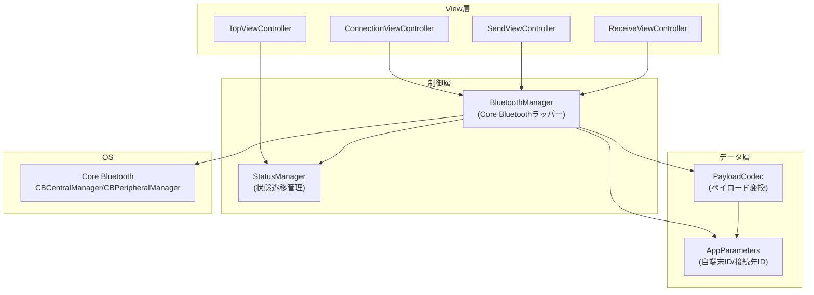
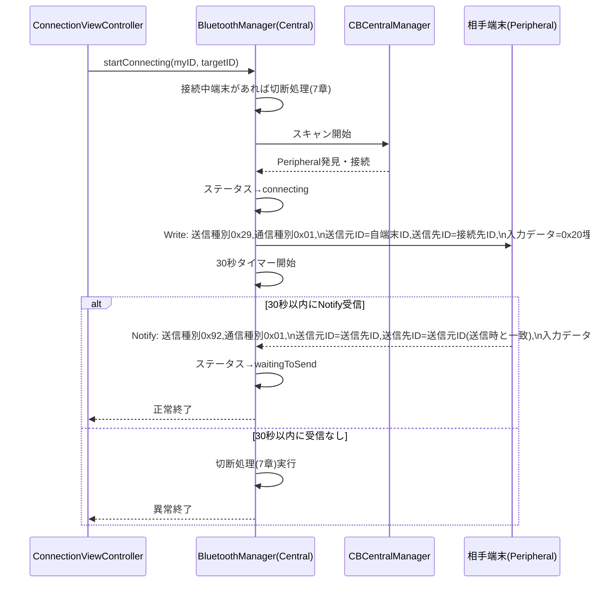
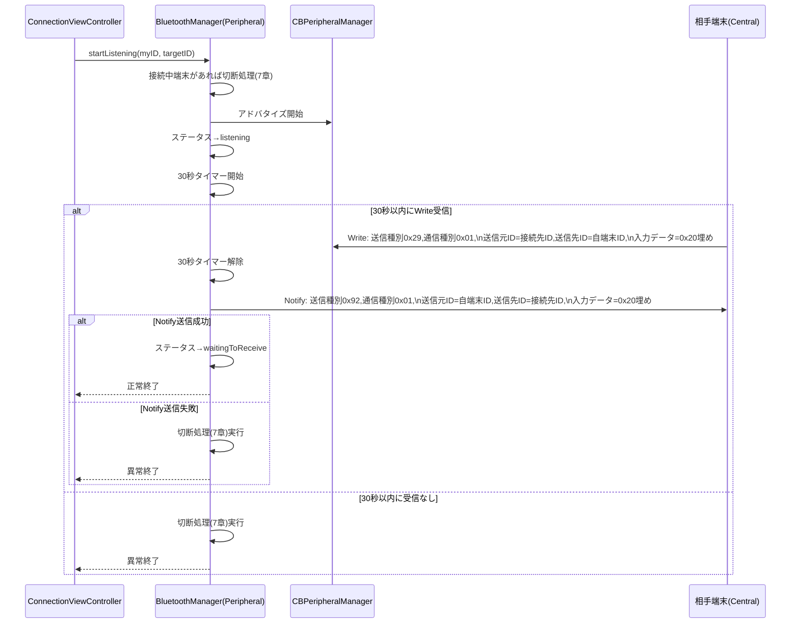
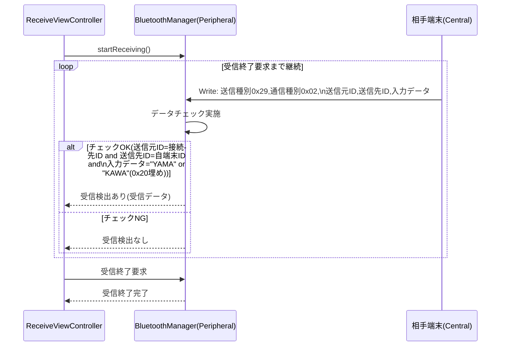

# PS設計書（プログラム仕様書）

## 改訂履歴

| 版数 | 日付 | 内容 |
|---|---|---|
| 1.0 | 2026-08-13 | 初版作成 |

## 0. 本書について

本書は Sample App のプログラム内部仕様を定義する。内部パラメータ、状態遷移、Bluetooth通信フォーマット、Core Bluetoothを用いた通信処理の詳細フローを記載する。画面仕様は「SS設計書」、画面レイアウトは「UI設計書」を参照すること。

### 0.1 前提・設計上の補足事項

要件定義書には明記されていないが、実装のために本書で以下の設計判断を行う。

| No | 項目 | 設計判断 | 理由 |
|---|---|---|---|
| 1 | 通信ライブラリ | 通信には**Core Bluetooth**を使用する | BLE(Bluetooth Low Energy)のみを使用し、Wi-Fiハードウェアには関与しない |
| 2 | ID→ペイロード変換 | 自端末ID／接続先ID（3桁の数値文字列 `000`〜`999`）をASCII変換し、3byteのバイナリとして格納する | — |
| 3 | Central/Peripheral役割 | 「接続開始」ボタン操作端末＝**Central**、「待受開始」ボタン操作端末＝**Peripheral** | Bluetooth通信開始処理（能動的に探索・接続・送信する側）とBluetooth待受開始処理（受動的に待ち受ける側）の役割がCore BluetoothのCentral/Peripheralモデルと自然に対応するため |
| 4 | GATT通信方向 | Central→Peripheralへの送信はWrite特性、Peripheral→Centralへの送信はNotify特性を用いる（片方向2特性構成） | 要件上、双方向で送信が発生するのは「5.Bluetooth通信開始処理」「6.Bluetooth待受開始処理」のハンドシェイクのみであり、データ受信処理側からの応答送信は不要なため、2特性で全シナリオを表現できる |
| 5 | 送信サイズ確認 | 書込み前に`peripheral.maximumWriteValueLength(for:)`を確認し、18byte以上であることを確認した上で`writeValue(_:for:type:)`を1回実行する（分割送信は行わない） | ペイロード18byteは固定長であり、MTU確認により1回の書込みで送信可能なため |

## 1. アーキテクチャ概要

| コンポーネント | 責務 |
|---|---|
| `AppParameters` | 内部パラメータ「自端末ID」「接続先ID」の保持・永続化 |
| `StatusManager` | 通信状態（ステータス）の保持・遷移・現在状態の通知 |
| `PayloadCodec` | 18byteペイロードのエンコード／デコード（ID⇔ASCII変換、パディング処理を含む） |
| `BluetoothManager` | Core Bluetoothの制御（Central/Peripheral役割切替、GATT定義、送受信、切断、タイムアウト管理） |
| 各`ViewController` | 画面表示・ユーザー操作の受付・`BluetoothManager`/`StatusManager`の呼び出し |

## 2. 内部パラメータ

| パラメータ名 | 型 | 初期値 | 入力範囲 | 説明 |
|---|---|---|---|---|
| 自端末ID | 数値文字列(3桁) | `"000"` | `"000"`〜`"999"` | 自端末を識別するID |
| 接続先ID | 数値文字列(3桁) | `"001"` | `"000"`〜`"999"` | 通信相手を識別するID |

初期値は「10.初期化処理」にてアプリ起動時に1度だけセットする。

## 3. ステータス（状態）仕様

### 3.1 状態一覧

| No | 状態名（和名） | 識別子（案） |
|---|---|---|
| 1 | アイドル | `idle` |
| 2 | Bluetooth通信開始処理中 | `connecting` |
| 3 | データ送信待ち中 | `waitingToSend` |
| 4 | Bluetooth通信待受処理中 | `listening` |
| 5 | データ受信待ち中 | `waitingToReceive` |
| 6 | データ受信停止中 | `receiveStopping` |
| 7 | データ送信処理中 | `sending` |

### 3.2 状態遷移契機一覧

| No | 遷移先状態 | 遷移契機 |
|---|---|---|
| 1 | アイドル | アプリ起動時 |
| 2 | アイドル | Bluetooth通信切断処理完了後 |
| 3 | Bluetooth通信開始処理中 | Bluetooth通信開始処理にて、通信開始のデータ送信時 |
| 4 | データ送信待ち中 | Bluetooth通信開始処理にて、コール元に正常終了を通知する時 |
| 5 | データ送信待ち中 | データ送信処理にて、データ送信完了時 |
| 6 | Bluetooth通信待受処理中 | Bluetooth通信待受処理にて、30秒間のデータ待受開始時 |
| 7 | データ受信待ち中 | Bluetooth通信待受処理にて、コール元に正常終了を通知する時 |
| 8 | データ受信待ち中 | データ受信画面にて、「再開」ボタンをタップしてデータ受信処理を開始した時 |
| 9 | データ受信停止中 | データ受信処理が「受信終了要求」を検出して、コール元に「受信終了完了」を通知する時 |
| 10 | データ送信処理中 | データ送信処理にて、データ送信開始時 |

### 3.3 状態遷移図

> 補足: `connecting → idle` および `listening → idle` の異常終了時の遷移は、いずれもBluetooth通信切断処理（6.4節）を経由する。

## 4. 通信フォーマット仕様

### 4.1 ペイロード構成（全18byte固定長）

| オフセット | 項目 | サイズ | 内容 |
|---|---|---|---|
| 0 | 送信種別 | 1byte | 要求時`0x29` / 応答時`0x92` |
| 1 | 通信種別 | 1byte | 通信開始・待受`0x01` / データ送受信`0x02` |
| 2〜4 | 送信元ID | 3byte | 送信元の端末IDをASCII変換した値 |
| 5〜7 | 送信先ID | 3byte | 送信先の端末IDをASCII変換した値 |
| 8〜17 | 入力データ | 10byte | バイナリデータ（詳細は用途毎に4.4参照） |

### 4.2 送信種別コード

| コード | 意味 |
|---|---|
| `0x29` | 要求 |
| `0x92` | 応答 |

### 4.3 通信種別コード

| コード | 意味 |
|---|---|
| `0x01` | Bluetooth通信開始・待受 |
| `0x02` | データ送受信 |

### 4.4 ID変換仕様

自端末ID／接続先ID（画面入力値、3桁数値文字列 `"000"`〜`"999"`）を、ASCII(0x30〜0x39)にエンコードし、3byteのバイナリとする。

### 4.5 入力データ領域（10byte）の用途別内容

| 用途 | 内容 |
|---|---|
| 通信開始要求／応答（通信種別`0x01`） | 全10byteを`0x20`（半角スペース）で埋める |
| データ送信（通信種別`0x02`、送信種別`0x29`） | データ送信画面で選択した文字列（`"YAMA"` or `"KAWA"`）をASCII変換し、残りのbyteを`0x20`で埋める |
| データ受信チェック対象（通信種別`0x02`、送信種別`0x29`） | ASCII文字列 `"YAMA"` または `"KAWA"`（残りは`0x20`埋め）であることをチェックする |

## 5. Core Bluetooth設計

### 5.1 Central/Peripheral役割

| 操作 | 役割 | 使用するマネージャ |
|---|---|---|
| 「接続開始」ボタン（Bluetooth通信開始処理） | Central | `CBCentralManager` |
| 「待受開始」ボタン（Bluetooth待受開始処理） | Peripheral | `CBPeripheralManager` |

本アプリは1:1通信であり、接続後は同一セッション内でCentral側が「データ送信画面」、Peripheral側が「データ受信画面」に遷移する。役割はアプリ起動中固定ではなく、ユーザーがどちらのボタンを押したかによって都度決定される。

### 5.2 GATTプロファイル定義

| 項目 | UUID（暫定値） | Properties | Permissions |
|---|---|---|---|
| Service | `00000000-0000-0000-0000-000000000001` | - | - |
| Request/Dataキャラクタリスティック（Central→Peripheral） | `00000000-0000-0000-0000-000000000002` | Write | Writeable |
| Responseキャラクタリスティック（Peripheral→Central） | `00000000-0000-0000-0000-000000000003` | Notify | - |

- **Request/Dataキャラクタリスティック**: Centralが「通信開始要求」（通信種別`0x01`）および「データ送信」（通信種別`0x02`）の18byteペイロードを書き込む。
- **Responseキャラクタリスティック**: Peripheralが「通信開始応答」（送信種別`0x92`、通信種別`0x01`）の18byteペイロードをNotifyで通知する。データ受信処理（9章）では応答送信は行わない。

> UUIDは暫定値。実装時に本書のUUIDをソースコードの定数として使用し、変更する場合は本書を追随して更新すること。

### 5.3 送信時のサイズ確認方針

書込み実行前に必ず `peripheral.maximumWriteValueLength(for: .withResponse)` を確認し、18byte以上であることを確認したうえで `writeValue(_:for:type: .withResponse)` を1回呼び出す。確認・書込みはサービス／キャラクタリスティック検出完了後（接続確立が安定した後）に行う。

### 5.4 現在接続中端末の切断（各処理共通の前処理）

「5.Bluetooth通信開始処理」「6.Bluetooth待受開始処理」の開始時には、現在接続中の端末がある場合、まず「7.Bluetooth通信切断処理」を実行してから処理を開始する。

## 6. 処理仕様

### 6.1 初期化処理

**契機**: アプリ起動時に1度だけ。

| Step | 処理内容 |
|---|---|
| 1 | ステータスに `idle`（アイドル）をセット |
| 2 | 内部パラメータ「自端末ID」に `"000"` をセット |
| 3 | 内部パラメータ「接続先ID」に `"001"` をセット |

### 6.2 Bluetooth通信開始処理（Central側）

**契機**: Bluetooth接続画面の「接続開始」ボタンタップ（不一致チェックOK後）。

| 項目 | 内容 |
|---|---|
| 事前条件 | 自端末IDと接続先IDが不一致であること（画面側でチェック済み） |
| 送信データ | 4.1のペイロードに、送信種別`0x29`固定、通信種別`0x01`、送信元ID=自端末ID、送信先ID=接続先ID、入力データ=`0x20`×10をセットして1回送信 |
| 待受内容 | 送信種別`0x92`固定、通信種別`0x01`、送信元ID=送信時の送信先ID、送信先ID=送信時の送信元ID、入力データ=`0x20`埋め を30秒間待受 |
| 正常系 | 30秒以内に上記データを検出 → ステータスを`waitingToSend`に遷移し、コール元に正常終了を通知 |
| 異常系 | 30秒以内に検出できず → 切断処理（7章）を実行後、コール元に異常終了を通知 |

### 6.3 Bluetooth待受開始処理（Peripheral側）

**契機**: Bluetooth接続画面の「待受開始」ボタンタップ（不一致チェックOK後）。

| 項目 | 内容 |
|---|---|
| 事前条件 | 自端末IDと接続先IDが不一致であること（画面側でチェック済み） |
| 待受内容 | 送信種別`0x29`固定、通信種別`0x01`、送信元ID=接続先ID、送信先ID=自端末ID、入力データ=`0x20`埋め を30秒間待受 |
| 検出時送信データ | 送信種別`0x92`固定、通信種別`0x01`、送信元ID=自端末ID、送信先ID=接続先ID、入力データ=`0x20`×10 を1回送信 |
| 正常系 | 送信成功 → ステータスを`waitingToReceive`に遷移し、コール元に正常終了を通知 |
| 異常系 | 30秒以内に未検出、または応答送信失敗 → 切断処理（7章）を実行後、コール元に異常終了を通知 |

### 6.4 Bluetooth通信切断処理

| Step | 処理内容 |
|---|---|
| 1 | Core Bluetoothの接続を切断する（Central側は`cancelPeripheralConnection`、Peripheral側はアドバタイズ停止・接続解除） |
| 2 | 切断処理完了後、ステータスを`idle`（アイドル）に初期化する |

他の全処理（6.2, 6.3, 6.5, 6.6）から異常系ハンドリングとして呼び出される共通処理。

### 6.5 データ送信処理（Central側／データ送信画面から呼び出し）

| 項目 | 内容 |
|---|---|
| 契機 | データ送信画面の「送信」ボタンタップ |
| ステータス遷移 | 開始時: `sending`（データ送信処理中）／完了時: `waitingToSend`（データ送信待ち中） |
| 送信データ | 送信種別`0x29`固定、通信種別`0x02`、送信元ID=自端末ID、送信先ID=接続先ID、入力データ=選択されたテストデータ（`YAMA`/`KAWA`）をASCII変換し残りを`0x20`埋め |
| 正常系 | 送信成功 → コール元に正常終了を通知 |
| 異常系 | 送信失敗 → 切断処理（7章＝6.4節）を実行後、コール元に異常終了を通知 |

### 6.6 データ受信処理（Peripheral側／データ受信画面から呼び出し）

| 項目 | 内容 |
|---|---|
| データチェック内容 | 送信種別=`0x29`、通信種別=`0x02`、送信元ID=接続先ID、送信先ID=自端末ID、入力データ=ASCII `"YAMA"` または `"KAWA"`（残りは`0x20`埋め） |
| チェックOK時 | コール元に「受信検出あり」を通知（受信データを含む） |
| チェックNG時 | コール元に「受信検出なし」を通知 |
| 受信終了要求検出時 | データ受信処理を終了し、ステータスを`receiveStopping`（データ受信停止中）に遷移させ、コール元に「受信終了完了」を通知 |

「受信終了要求」はUI側（データ受信画面の「戻る」ボタン、または受信検出後の内部フロー）から非同期に発行される要求であり、受信処理はこれをポーリングまたはフラグ監視で検出する。

## 7. エラーハンドリング方針

| 状況 | 方針 |
|---|---|
| Bluetooth権限が無い状態での通信処理呼び出し | Bluetooth接続画面で権限確認済みであることを前提とし、本処理層では権限エラーを異常終了として扱い切断処理を実行する |
| 通信中の予期しない切断（相手端末の電源OFF等） | Core BluetoothのDelegateで切断を検知し、進行中の処理があれば異常終了としてコール元に通知、ステータスをアイドルに初期化する |
| タイムアウト（30秒） | `DispatchSourceTimer`等を用いて管理し、タイムアウト検出時は切断処理を実行してから異常終了を通知する |

## 8. クラス構成（概要設計）

| クラス/型 | 種別 | 概要 |
|---|---|---|
| `AppParameters` | struct/class | 自端末ID・接続先IDの保持 |
| `AppStatus` | enum | 3.1の状態一覧 |
| `StatusManager` | class | 現在ステータスの保持・変更通知（Observer/Delegateまたは Combine/Closure） |
| `PayloadType` | enum | 送信種別（`request = 0x29`, `response = 0x92`） |
| `CommunicationType` | enum | 通信種別（`connection = 0x01`, `data = 0x02`） |
| `Payload` | struct | 18byteペイロードのモデル（送信種別/通信種別/送信元ID/送信先ID/入力データ） |
| `PayloadCodec` | class/enum(static) | `Payload` ⇔ `Data`(18byte) の相互変換、ID⇔ASCII変換 |
| `BluetoothManager` | class | Core Bluetoothの制御全般（`CBCentralManagerDelegate`, `CBPeripheralManagerDelegate`, `CBPeripheralDelegate`実装） |

## 9. 用語集

| 用語 | 説明 |
|---|---|
| Central | Core BluetoothにおけるBLEクライアント役。周辺機器をスキャン・接続する側 |
| Peripheral | Core BluetoothにおけるBLEサーバー役。アドバタイズし接続を待ち受ける側 |
| GATT | BLEで使用されるデータ構造の規格（Service/Characteristic） |
| MTU | Maximum Transmission Unit。BLEの1回の通信で送受信可能な最大データ長 |
