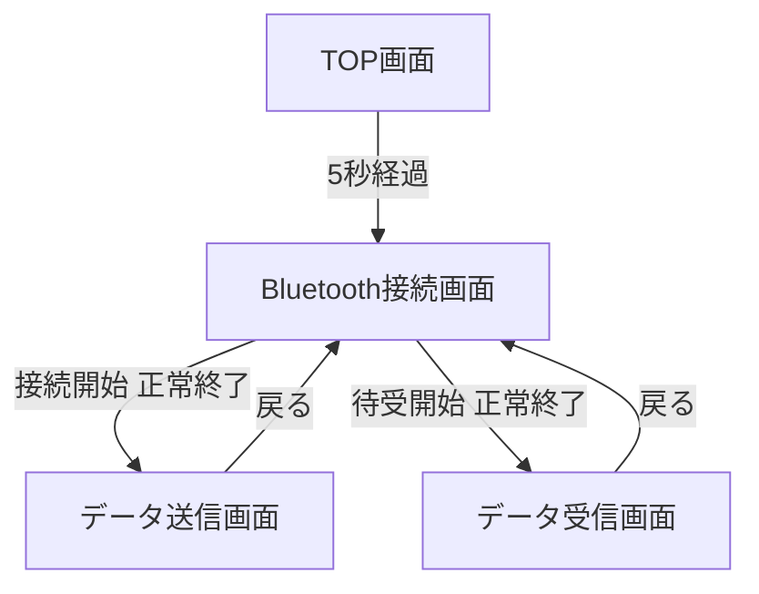
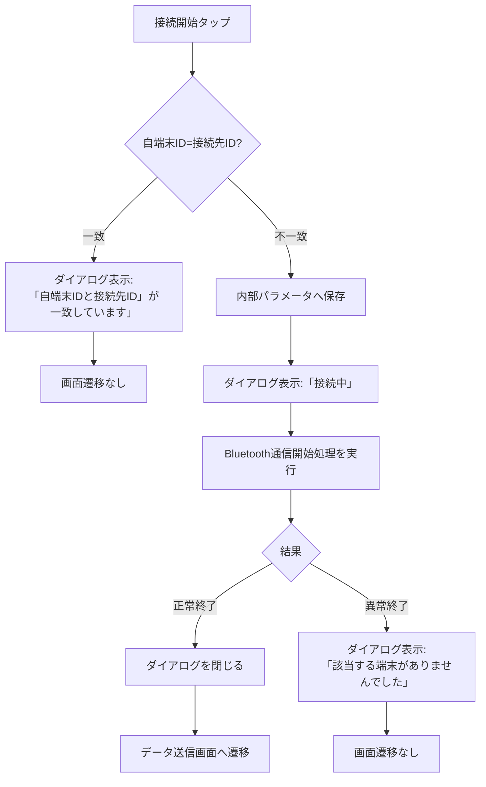
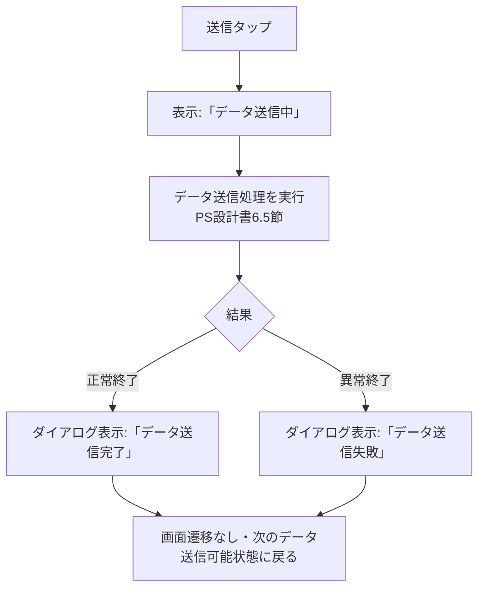
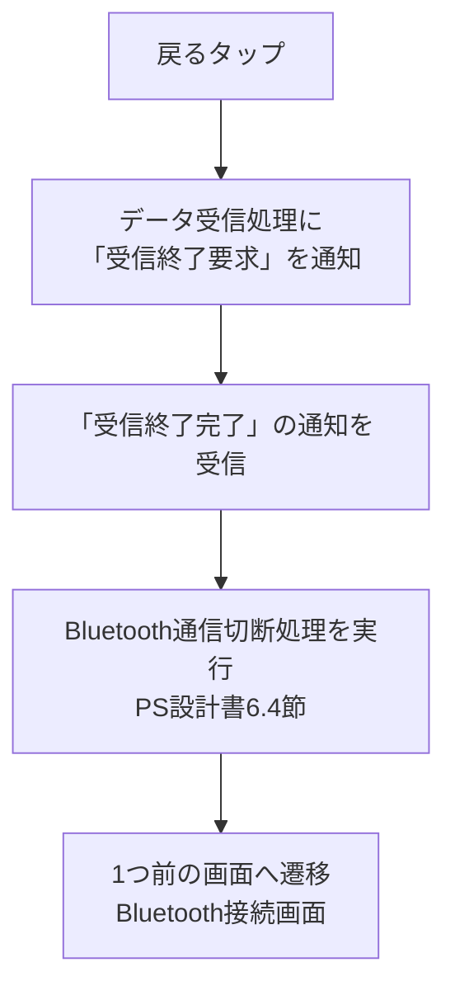

# SS設計書（画面仕様書）

## 改訂履歴

| 版数 | 日付 | 内容 |
|---|---|---|
| 1.0 | 2026-08-13 | 初版作成 |

## 0. 本書について

本書は各画面の表示内容・入力項目・ボタン押下時の処理順序・ダイアログ仕様を定義する。処理の内部詳細（通信フォーマット、状態遷移等）は「PS設計書」を、画面レイアウト（部品配置）は「UI設計書」を参照すること。

## 1. 画面一覧

| No | 画面名 | 画面ID | 概要 |
|---|---|---|---|
| 1 | TOP画面 | `TopView` | アプリ起動画面。5秒表示後に自動遷移 |
| 2 | Bluetooth接続画面 | `ConnectionView` | 自端末ID/接続先ID入力、接続開始/待受開始 |
| 3 | データ送信画面 | `SendView` | テストデータ送信 |
| 4 | データ受信画面 | `ReceiveView` | データ受信・表示 |

## 2. 画面遷移図



## 3. TOP画面仕様

| 項目 | 内容 |
|---|---|
| 表示内容 | 画面中央に文字列「Sample App」を表示する |
| 遷移条件 | 画面表示から5秒経過後、自動的にBluetooth接続画面へ遷移する |
| 入力項目 | なし |

## 4. Bluetooth接続画面仕様

### 4.1 Bluetooth使用許可確認

| No | タイミング | 処理内容 |
|---|---|---|
| 1 | 画面遷移時 | Bluetooth使用許可ダイアログ（OS標準）を表示する |
| 2 | 使用不許可を選択した場合 | 「設定からBluetoothの使用を許可してください」等、設定変更を促す表示を固定的に表示する（本画面から他画面へは遷移させない） |
| 3 | 使用許可を選択した場合 | 4.2以降の入力項目・ボタンを表示する |
| 4 | 2回目以降の起動時 | 前回使用許可済み、かつアプリ再起動時に使用不許可状態を検出しない限り、使用許可ダイアログは再表示しない |

> 実装メモ: Core Bluetoothの権限状態は`CBManagerAuthorization`で判定する。`.notDetermined`の場合のみOS標準の許可ダイアログが表示される。`.denied`/`.restricted`の場合は上記No.2の固定表示を行う。

### 4.2 入力項目

| 項目名 | 型 | 桁数 | 入力範囲 | 初期表示値 | 入力可否 |
|---|---|---|---|---|---|
| 自端末ID | 数値文字列 | 3桁 | `000`〜`999` | 内部パラメータ「自端末ID」の値 | 可（数値以外は入力不可） |
| 接続先ID | 数値文字列 | 3桁 | `000`〜`999` | 内部パラメータ「接続先ID」の値 | 可（数値以外は入力不可） |

- 画面遷移時、内部パラメータ「自端末ID」「接続先ID」の値をそれぞれの入力項目に表示する。
- 入力可能文字は半角数値のみ。それ以外の文字は入力を許可しない（キーボードは数値専用を使用する想定）。
- 入力桁数は最大3桁までとする。

### 4.3 ボタン仕様

「接続開始」ボタンと「待受開始」ボタンは横並びで配置する。

#### 4.3.1 共通処理（不一致チェック）

いずれのボタンも、タップ時にまず以下の「自端末IDと接続先IDの不一致チェック」を行う。

| チェック結果 | 処理内容 |
|---|---|
| 一致（自端末ID = 接続先ID） | ダイアログ「自端末IDと接続先ID」が一致しています」を表示する。Bluetooth通信開始処理／待受処理は開始せず、画面遷移も行わない |
| 不一致 | 入力項目「自端末ID」「接続先ID」の入力値を、それぞれ内部パラメータ「自端末ID」「接続先ID」に保存したうえで、後続の処理を開始する |

#### 4.3.2 「接続開始」ボタン



| 状態 | ダイアログ表示 |
|---|---|
| 処理中 | 「接続中」を表示する（PS設計書 6.2節のBluetooth通信開始処理を実行） |
| 正常終了 | ダイアログを閉じ、データ送信画面へ遷移する |
| 異常終了 | 「該当する端末がありませんでした」を表示し、画面遷移は行わない |

#### 4.3.3 「待受開始」ボタン

| 状態 | ダイアログ表示 |
|---|---|
| 処理中 | 「接続中」を表示する（PS設計書 6.3節のBluetooth待受開始処理を実行） |
| 正常終了 | ダイアログを閉じ、データ受信画面へ遷移する |
| 異常終了 | 「該当する端末がありませんでした」を表示し、画面遷移は行わない |

処理フローは4.3.2と同様（不一致チェック→保存→処理中ダイアログ→結果分岐）とする。

### 4.4 ダイアログ文言一覧（Bluetooth接続画面）

| No | 文言 | 表示契機 | ボタン |
|---|---|---|---|
| 1 | （OS標準）Bluetooth使用許可確認 | 画面遷移時（初回のみ） | OS標準 |
| 2 | 設定からBluetoothの使用を許可してください（固定表示） | 使用不許可時 | なし（固定表示） |
| 3 | 「自端末IDと接続先ID」が一致しています | ID不一致チェックでNG | OK |
| 4 | 接続中 | 通信開始/待受処理の実行中 | なし |
| 5 | 該当する端末がありませんでした | 通信開始/待受処理の異常終了時 | OK |

## 5. データ送信画面仕様

### 5.1 表示項目

| 項目名 | 内容 |
|---|---|
| 接続先ID | 内部パラメータ「接続先ID」の値を表示（表示のみ） |

### 5.2 入力項目

| 項目名 | 種別 | 選択肢 |
|---|---|---|
| 送信データ | プルダウン（`UIPickerView`） | `YAMA` / `KAWA` |

### 5.3 「戻る」ボタン仕様

| 状態 | 処理内容 |
|---|---|
| データ送信処理中でない場合 | Bluetooth通信切断処理（PS設計書 6.4節）を実行完了後、1つ前の画面（Bluetooth接続画面）へ遷移する |
| データ送信処理中の場合 | ダイアログ「データ送信中は画面の切り替えができません」を表示し、画面遷移は行わない |

### 5.4 「送信」ボタン仕様



| 状態 | 表示 |
|---|---|
| 処理中 | 「データ送信中」を表示する |
| 正常終了 | ダイアログ「データ送信完了」を表示する。画面遷移はせず、次のデータを送信可能な状態に戻る |
| 異常終了 | ダイアログ「データ送信失敗」を表示する。画面遷移はせず、次のデータを送信可能な状態に戻る |

### 5.5 ダイアログ文言一覧（データ送信画面）

| No | 文言 | 表示契機 | ボタン |
|---|---|---|---|
| 1 | データ送信中は画面の切り替えができません | 送信処理中に「戻る」タップ時 | OK |
| 2 | データ送信完了 | 送信処理 正常終了時 | OK |
| 3 | データ送信失敗 | 送信処理 異常終了時 | OK |

## 6. データ受信画面仕様

### 6.1 画面遷移時の表示

| 項目 | 内容 |
|---|---|
| 「戻る」ボタン | 表示 |
| 大項目「受信データ」 | 文字表示のみ |
| 小項目「送信元ID」 | 空欄で表示 |
| 小項目「送信先ID」 | 空欄で表示 |
| 小項目「データ」 | 空欄で表示 |

### 6.2 画面遷移直後の処理フロー

```mermaid
flowchart TD
    A[データ受信画面へ遷移] --> B[部品表示]
    B --> C[前面に「受信中」ダイアログ表示\n(OKボタンなし)]
    C --> D[データ受信処理を開始\nPS設計書6.6節]
    D --> E{受信結果}
    E -->|受信検出あり| F[ダイアログ表示を\n「データ受信完了」に変化]
    F --> G[受信終了要求を通知]
    G --> H[受信終了完了を検出]
    H --> I[小項目に受信データを表示\n送信元ID/送信先ID/データ]
    I --> J[「受信再開」ボタンを表示]
    E -->|受信検出なし| K[ダイアログ表示:\n「データを受信しましたが、\n不正データでした。」]
```

| No | 状態 | 内容 |
|---|---|---|
| 1 | 受信中 | 「受信中」ダイアログを表示（OKボタンなし・表示固定） |
| 2 | 受信検出あり | ダイアログ表示を「データ受信完了」に変化させ、データ受信処理に「受信終了要求」を通知。「受信終了完了」検出後、小項目「送信元ID」「送信先ID」「データ」に受信データを文字列表示し、「受信再開」ボタンを表示する |
| 3 | 受信検出なし | ダイアログ「データを受信しましたが、不正データでした。」を表示する |

### 6.3 「受信再開」ボタン仕様

タップすると、データ受信処理（PS設計書 6.6節）を再度開始する（ステータス: `waitingToReceive` へ遷移。処理内容は6.2の受信処理フローと同様）。

### 6.4 「戻る」ボタン仕様



| Step | 処理内容 |
|---|---|
| 1 | データ受信処理に「受信終了要求」を通知し、「受信終了完了」の通知を受けるまで待機する |
| 2 | Bluetooth通信切断処理を実行する |
| 3 | 1つ前の画面（Bluetooth接続画面）へ遷移する |

### 6.5 ダイアログ文言一覧（データ受信画面）

| No | 文言 | 表示契機 | ボタン |
|---|---|---|---|
| 1 | 受信中 | 画面遷移直後、受信処理開始時（表示固定） | なし |
| 2 | データ受信完了 | 受信検出あり検出時（「受信中」から表示変化） | なし（表示後、小項目更新・ボタン表示へ遷移） |
| 3 | データを受信しましたが、不正データでした。 | 受信検出なし検出時 | OK |

## 7. 全画面共通ダイアログ文言一覧（横断まとめ）

| 画面 | 文言 |
|---|---|
| Bluetooth接続画面 | 「自端末IDと接続先ID」が一致しています |
| Bluetooth接続画面 | 接続中 |
| Bluetooth接続画面 | 該当する端末がありませんでした |
| Bluetooth接続画面 | 設定からBluetoothの使用を許可してください（固定表示） |
| データ送信画面 | データ送信中は画面の切り替えができません |
| データ送信画面 | データ送信完了 |
| データ送信画面 | データ送信失敗 |
| データ受信画面 | 受信中 |
| データ受信画面 | データ受信完了 |
| データ受信画面 | データを受信しましたが、不正データでした。 |

## 8. バリデーション仕様一覧

| 画面 | 項目 | ルール |
|---|---|---|
| Bluetooth接続画面 | 自端末ID | 半角数値のみ、最大3桁、範囲 `000`〜`999` |
| Bluetooth接続画面 | 接続先ID | 半角数値のみ、最大3桁、範囲 `000`〜`999` |
| Bluetooth接続画面 | 自端末ID / 接続先ID 不一致 | ボタン押下時、両者が一致していないこと |
