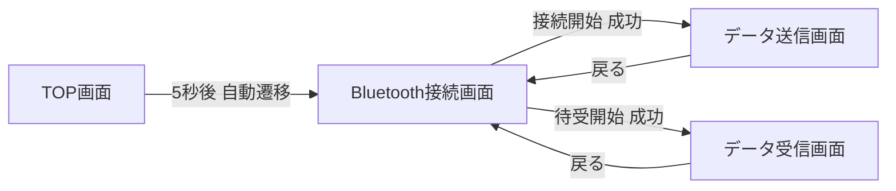

# UI設計書

## 改訂履歴

| 版数 | 日付 | 内容 |
|---|---|---|
| 1.0 | 2026-08-13 | 初版作成 |
| 1.1 | 2026-08-23 | 7章「受信中」をダイアログ（`alertReceiving`）から画面内表示（`lblStatus`）に変更（「戻る」ボタン操作を妨げないため） |

## 0. 本書について

本書は各画面のUI部品配置・デザイン方針を定義する。項目ごとの詳細な動作仕様（バリデーション、ボタン押下時処理、ダイアログ文言等）は「SS設計書」を、内部処理仕様は「PS設計書」を参照すること。

## 1. デザイン方針

| 方針 | 内容 |
|---|---|
| 使用部品 | UIKit標準部品のみを使用し、サードパーティのUIライブラリには依存しない |
| レイアウト | Auto Layout（`NSLayoutConstraint` / `UIStackView`）を用い、iPad・iPhoneの画面サイズ差、および画面回転に対応する |
| 画面回転・マルチタスク | iPadのマルチタスク機能（Slide Over／Split View）に対応するため、縦向き・逆さ縦向き・横向き（左右）の4方向すべての画面回転をサポートする（マルチタスクを禁止するフルスクリーン専有モードは採用しない） |
| 配色・フォント | OS標準のシステムカラー（`UIColor.systemBackground`等）・システムフォント（`UIFont.preferredFont(forTextStyle:)`）を使用し、ライトモード／ダークモード双方に対応する |
| ダイアログ | すべて`UIAlertController`（`.alert`スタイル）を使用する |
| ナビゲーション | `UINavigationController`によるpush/pop遷移を基本とする（TOP画面→Bluetooth接続画面は自動遷移のため`setViewControllers`等で置き換える） |

## 2. 画面一覧

| No | 画面名 | 画面ID |
|---|---|---|
| 1 | TOP画面 | `TopView` |
| 2 | Bluetooth接続画面 | `ConnectionView` |
| 3 | データ送信画面 | `SendView` |
| 4 | データ受信画面 | `ReceiveView` |

## 3. 画面遷移図



## 4. TOP画面

### 4.1 ワイヤーフレーム

```
┌──────────────────────────────┐
│                                │
│                                │
│                                │
│           Sample App          │
│                                │
│                                │
│                                │
└──────────────────────────────┘
```

### 4.2 部品一覧

| 部品ID | 種別 | 内容 | 配置 |
|---|---|---|---|
| `lblTitle` | `UILabel` | "Sample App" | 画面中央（水平・垂直中央揃え） |

## 5. Bluetooth接続画面

### 5.1 ワイヤーフレーム

```
┌──────────────────────────────┐
│  Bluetooth接続                │
├──────────────────────────────┤
│                                │
│  自端末ID   [ 000        ]    │
│                                │
│  接続先ID   [ 001        ]    │
│                                │
│                                │
│   [ 接続開始 ]   [ 待受開始 ] │
│                                │
└──────────────────────────────┘
```

「不許可」選択時（前面にダイアログを固定表示、背面の入力項目・ボタンは表示しない）:

```
┌──────────────────────────────┐
│  Bluetooth接続                │
├──────────────────────────────┤   ┌───────────────────────┐
│                                │   │ 設定からBluetoothの   │
│                                │   │ 使用を許可してアプリを │
│                                │   │ 再起動してください。   │
│                                │   └───────────────────────┘
└──────────────────────────────┘
```

### 5.2 部品一覧

| 部品ID | 種別 | 内容 | 配置 |
|---|---|---|---|
| `lblMyIdTitle` | `UILabel` | "自端末ID" | 上段左 |
| `txtMyId` | `UITextField`（数値専用キーボード, `keyboardType = .numberPad`, 最大3桁の入力制限） | 内部パラメータ「自端末ID」表示 | 上段右 |
| `lblTargetIdTitle` | `UILabel` | "接続先ID" | 中段左 |
| `txtTargetId` | `UITextField`（数値専用キーボード, `keyboardType = .numberPad`, 最大3桁の入力制限） | 内部パラメータ「接続先ID」表示 | 中段右 |
| `btnConnect` | `UIButton`（`.filled`スタイル） | "接続開始" | 下段左（`UIStackView`で`btnListen`と横並び） |
| `btnListen` | `UIButton`（`.filled`スタイル） | "待受開始" | 下段右（`UIStackView`で`btnConnect`と横並び） |
| （ダイアログ）`alertPermissionDenied` | `UIAlertController`（ボタンなし、固定表示） | "設定からBluetoothの使用を許可してアプリを再起動してください。" | 画面前面モーダル |

## 6. データ送信画面

### 6.1 ワイヤーフレーム

```
┌──────────────────────────────┐
│ [戻る]  データ送信            │
├──────────────────────────────┤
│                                │
│  接続先ID    001               │
│                                │
│  送信データ  [ YAMA  ▼ ]      │
│                                │
│         [   送信   ]          │
│                                │
└──────────────────────────────┘
```

処理中（前面にダイアログを固定表示）:

```
┌──────────────────────────────┐
│ [戻る]  データ送信            │   ┌───────────────┐
├──────────────────────────────┤   │  データ送信中  │
│  ...（背面は上図と同様）      │   └───────────────┘
└──────────────────────────────┘
```

### 6.2 部品一覧

| 部品ID | 種別 | 内容 | 配置 |
|---|---|---|---|
| `btnBack` | `UIBarButtonItem`（`UINavigationBar`左） | "戻る" | ナビゲーションバー左 |
| `lblTargetIdTitle` | `UILabel` | "接続先ID" | 上段左 |
| `lblTargetIdValue` | `UILabel` | 内部パラメータ「接続先ID」の値（表示のみ） | 上段右 |
| `lblSendDataTitle` | `UILabel` | "送信データ" | 中段左 |
| `pickerSendData` | `UIPickerView`（`UITextField.inputView`として使用、または画面内固定表示） | 選択肢: "YAMA" / "KAWA" | 中段右 |
| `btnSend` | `UIButton`（`.filled`スタイル） | "送信" | 下段中央 |
| （ダイアログ）`alertSending` | `UIAlertController`（ボタンなし） | "データ送信中" | 画面前面モーダル（送信処理中のみ表示） |

## 7. データ受信画面

### 7.1 ワイヤーフレーム

```
┌──────────────────────────────┐
│ [戻る]  データ受信            │
├──────────────────────────────┤
│                                │
│  受信データ                    │
│    受信中                      │
│    送信元ID   [        ]      │
│    送信先ID   [        ]      │
│    データ     [        ]      │
│                                │
│         [ 受信再開 ]          │
│                                │
└──────────────────────────────┘
```

「受信中」は画面内の固定表示であり、ダイアログではない（「戻る」ボタン操作を妨げないため）。
「データ受信完了」「データを受信しましたが、不正データでした。」表示中は、引き続き画面前面モーダルのダイアログを使用する（7.2節参照）。

### 7.2 部品一覧

| 部品ID | 種別 | 内容 | 配置 | 初期状態 |
|---|---|---|---|---|
| `btnBack` | `UIBarButtonItem`（`UINavigationBar`左） | "戻る" | ナビゲーションバー左 | 常時表示 |
| `lblReceiveDataTitle` | `UILabel`（大項目） | "受信データ" | 上段 | 表示 |
| `lblStatus` | `UILabel` | "受信中" | 上段（大項目の下） | 受信処理実行中のみ表示。ダイアログではないため、表示中も「戻る」ボタンの操作は可能 |
| `lblSourceIdTitle` | `UILabel`（小項目ラベル） | "送信元ID" | 中段左 | 表示 |
| `lblSourceIdValue` | `UILabel` | 受信データの送信元ID | 中段右 | 空欄 |
| `lblDestIdTitle` | `UILabel`（小項目ラベル） | "送信先ID" | 中段左 | 表示 |
| `lblDestIdValue` | `UILabel` | 受信データの送信先ID | 中段右 | 空欄 |
| `lblDataTitle` | `UILabel`（小項目ラベル） | "データ" | 中段左 | 表示 |
| `lblDataValue` | `UILabel` | 受信データの入力データ | 中段右 | 空欄 |
| `btnResume` | `UIButton`（`.filled`スタイル） | "受信再開" | 下段中央 | 非表示（受信検出後に表示。ダイアログ表示中は操作不可） |
| （ダイアログ）`alertReceiveComplete` | `UIAlertController`（OKボタンあり） | "データ受信完了" | 画面前面モーダル | 受信検出あり時に表示。表示時点で背面は受信データ表示・「受信再開」ボタン表示済み。表示中は背面の「受信再開」「戻る」ボタン操作不可 |
| （ダイアログ）`alertInvalidData` | `UIAlertController`（OKボタンあり） | "データを受信しましたが、不正データでした。" | 画面前面モーダル | 受信検出なし時に表示。表示中は背面の「戻る」ボタン操作不可。OK未操作のまま5秒経過で「受信中」表示に戻る |

## 8. 共通UI部品仕様

| 項目 | 仕様 |
|---|---|
| ボタン | `UIButton.Configuration.filled()`を基本とし、無効時は`isEnabled = false`でグレーアウト表示する |
| テキストフィールド | 罫線付き角丸スタイル（`.roundedRect`）、プレースホルダなし（初期値を直接表示） |
| ダイアログ | タイトルなし・メッセージのみの`UIAlertController(.alert)`を基本とする。OKボタン非搭載のダイアログ（処理中表示）は`actions`を空にする |
| ラベル階層 | 大項目は`UIFont.preferredFont(forTextStyle: .headline)`、小項目・通常テキストは`.body`を使用 |

## 9. アクセシビリティ

| 項目 | 対応方針 |
|---|---|
| Dynamic Type | システムフォント（`preferredFont(forTextStyle:)`）を使用し、文字サイズ変更に追従する |
| VoiceOver | 各入力項目・ボタンに`accessibilityLabel`を設定する（例: 自端末ID入力欄→「自端末ID入力」） |
| コントラスト | システムカラーを使用し、ライト/ダークモードでのコントラスト比をOS標準に委ねる |
