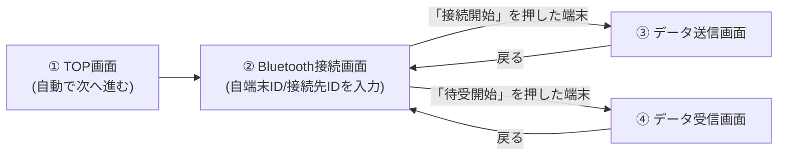

# 操作説明書

## 改訂履歴

| 版数 | 日付 | 内容 |
|---|---|---|
| 1.0 | 2026-08-14 | 初版作成 |

## 0. 本書について

本書は、Sample App（Bluetooth通信アプリ）を実際に操作するユーザー向けの説明書である。

## 1. 概要

本アプリは、Bluetooth（Bluetooth Low Energy）を使って、**2台の端末（iPadまたはiPhone）の間で短いテキストデータを送受信する**サンプルアプリである。

- 1台が「送る側」、もう1台が「受け取る側」になる、1対1の通信専用アプリである
- **必ず2台の端末が必要**で、片方の端末だけでは通信の確認はできない
- 送受信できるデータは、あらかじめ用意された`YAMA`または`KAWA`の2種類のみ（自由入力はできない）

## 2. 準備するもの

| 項目 | 内容 |
|---|---|
| 端末 | iPad または iPhone（2台） |
| Bluetooth | 両方の端末でオンになっていること |
| Wi-Fi | 本アプリはWi-Fiを使用しない。オン・オフどちらでも動作に影響しない |
| 距離 | Bluetoothが届く範囲（一般的に数m程度）に2台を近づけておく |

## 3. 画面の流れ（全体像）

2台の端末はペアで操作する。**1台の端末は「待受開始」を押して待受開始済みの状態にしておき、その状態のところへ、もう1台の端末が「待受開始」ではなく「接続開始」を押す**ことでつながる。両方が同じボタンを押しても通信は成立しない。

## 4. 各画面の操作方法

### 4.1 ① TOP画面

アプリを起動すると最初に表示される画面。画面中央に「Sample App」と表示され、**何も操作しなくても5秒後に自動的に次の画面（Bluetooth接続画面）に進む**。

### 4.2 ② Bluetooth接続画面

#### 初回起動時の許可確認

初めてこの画面が表示される時、「Bluetoothの使用を許可しますか」という趣旨のダイアログがOSから表示される。

| 選択 | 結果 |
|---|---|
| 許可する | 通常通り、ID入力欄とボタンが表示される |
| 許可しない | 「設定からBluetoothの使用を許可してアプリを再起動してください。」という表示のまま先に進めなくなる。詳しくは[8.3](#83-bluetoothの使用を許可しないを選んでしまった)を参照 |

一度「許可する」を選ぶと、次回以降このダイアログは表示されない。

#### 通常の操作

| 項目 | 説明 |
|---|---|
| 自端末ID | 自分の端末を表す3桁の数字（000〜999）。初期値は`000` |
| 接続先ID | 通信相手の端末を表す3桁の数字（000〜999）。初期値は`001` |
| 「接続開始」ボタン | 相手を探しに行く側（送る側）が押す |
| 「待受開始」ボタン | 相手からの接続を待つ側（受け取る側）が押す |

**重要：2台のIDは「入れ替え」の関係にする必要がある。**

| | 自端末ID | 接続先ID |
|---|---|---|
| 端末A（送る側の例） | 000 | 001 |
| 端末B（受け取る側の例） | 001 | 000 |

端末Aの「接続先ID」と端末Bの「自端末ID」が一致し、かつ端末Bの「接続先ID」と端末Aの「自端末ID」が一致している必要がある。**両方の初期値（自端末ID=000、接続先ID=001）をそのまま使うと2台とも同じ設定になり、一致しないため通信できない。** どちらか一方の端末で、自端末IDと接続先IDを入れ替えて入力すること。

同じ端末の中で自端末IDと接続先IDに同じ数字を入力すると、「『自端末IDと接続先ID』が一致しています」という表示が出て先に進めない。必ず異なる数字にすること。

#### 操作手順（2台で1組として）

1. 端末Aと端末Bの両方でアプリを起動し、この画面まで進める
2. 端末BのID（自端末ID・接続先ID）を、端末Aと入れ替えの関係になるよう入力する
3. **30秒以内に**、端末Bで先に「待受開始」を押し、続けて端末Aで「接続開始」を押す
4. 双方の画面に「接続中」の表示が出た後、「接続成功」の表示が1秒ほど出て、自動的に次の画面に進む
   - 端末A（接続開始した側）→ データ送信画面
   - 端末B（待受開始した側）→ データ受信画面

### 4.3 ③ データ送信画面（「接続開始」した側）

| 項目 | 説明 |
|---|---|
| 接続先ID表示 | 相手のIDが表示される（確認用、変更不可） |
| 送信データ選択 | `YAMA`または`KAWA`をプルダウンで選択する |
| 「送信」ボタン | 選択したデータを相手に送る |
| 「戻る」ボタン | Bluetooth接続画面に戻る（送信中は押せない） |

「送信」を押すと「データ送信中」と表示され、完了すると「データ送信完了」（失敗時は「データ送信失敗」）が表示される。表示後は自動的に閉じて、続けて次のデータを送信できる状態に戻る（画面は移動しない）。

### 4.4 ④ データ受信画面（「待受開始」した側）

画面に移動すると同時に「受信中」という表示が出て、相手からのデータを待つ。

| 結果 | 画面の動き |
|---|---|
| 正しいデータ（YAMA/KAWA）を受信した場合 | 「データ受信完了」の表示に変わり、OKを押すと、画面下部に相手の送信元ID・送信先ID・受信データが表示される。「受信再開」ボタンが表示される |
| データを受信したが内容が不正だった場合 | 「データを受信しましたが、不正データでした。」と表示される。OKを押すか、何もせず5秒経つと、自動的に「受信中」表示に戻り、待受を継続する |

続けて別のデータを受け取りたい場合は「受信再開」ボタンを押す。

「戻る」ボタンを押すと、受信処理を終了したうえでBluetooth接続画面に戻る。

## 5. 基本的な使い方（一連の流れの例）

1. 端末A・端末Bの両方でアプリを起動する
2. Bluetooth使用許可を両方とも「許可」にする（初回のみ）
3. 端末Bで自端末ID・接続先IDを端末Aと入れ替えの関係に設定する
4. 端末Bで「待受開始」を押す
5. 30秒以内に端末Aで「接続開始」を押す
6. 両端末とも「接続成功」の表示を経て、端末Aはデータ送信画面、端末Bはデータ受信画面に進む
7. 端末Aで送信データ（YAMA/KAWA）を選び「送信」を押す
8. 端末Bに「データ受信完了」が表示され、OKを押すと受信内容が確認できる
9. 続けて送りたい場合は端末Aで再度「送信」、端末Bで「受信再開」を押す
10. 終了する場合は両端末とも「戻る」を押してBluetooth接続画面に戻る

## 6. 表示されるメッセージ一覧（正常時）

| 表示場所 | メッセージ | 意味 |
|---|---|---|
| Bluetooth接続画面 | 接続中 | 相手を探している／相手からの接続を待っている最中 |
| Bluetooth接続画面 | 接続成功 | 相手とつながった（1秒後、自動的に次の画面へ） |
| データ送信画面 | データ送信中 | データを送っている最中 |
| データ送信画面 | データ送信完了 | 送信が成功した |
| データ受信画面 | 受信中 | データを待っている最中 |
| データ受信画面 | データ受信完了 | 正しいデータを受け取った |

## 7. 表示されるメッセージ一覧（異常時）

| 表示場所 | メッセージ | 意味 | 対処 |
|---|---|---|---|
| Bluetooth接続画面 | 「自端末IDと接続先ID」が一致しています | 自分の端末の中で、自端末IDと接続先IDに同じ数字を入力した | どちらかのIDを変更する（[4.2](#42-②-bluetooth接続画面)参照） |
| Bluetooth接続画面 | 該当する端末がありませんでした | 30秒以内に相手が見つからなかった／応答がなかった | [8.1](#81-該当する端末がありませんでしたと表示される)を参照 |
| Bluetooth接続画面 | 設定からBluetoothの使用を許可してアプリを再起動してください。 | Bluetoothの使用を「許可しない」にした | [8.3](#83-bluetoothの使用を許可しないを選んでしまった)を参照 |
| データ送信画面 | データ送信中は画面の切り替えができません | 送信処理中に「戻る」を押した | 送信が終わるまで待ってから「戻る」を押す |
| データ送信画面 | データ送信失敗 | 送信に失敗した（相手が切断された等） | 「戻る」で接続画面に戻り、再度接続からやり直す |
| データ送信画面／データ受信画面 | Bluetooth通信が切断されました。再接続してください | 通信中に相手との接続が切れた（相手の電源OFF、距離が離れた等） | OKを押すとBluetooth接続画面に戻るので、[8.2](#82-通信中に接続が切れた)を参照して再接続する |
| データ受信画面 | データを受信しましたが、不正データでした。 | 受信したデータの形式が正しくなかった（IDの不一致・想定外の内容） | 通常は自動的に受信を継続するため、特別な対処は不要 |

## 8. トラブルシューティング

### 8.1 「該当する端末がありませんでした」と表示される

考えられる原因と対処は以下の通り。

| 原因 | 対処 |
|---|---|
| 2台のIDが正しく「入れ替え」の関係になっていない | [4.2](#42-②-bluetooth接続画面)の表を参考に、自端末ID・接続先IDを確認する |
| 「待受開始」を押す前に「接続開始」を押してしまった、またはタイミングが30秒以上ずれた | 先に受け取る側で「待受開始」を押してから、30秒以内に送る側で「接続開始」を押し直す |
| 2台の距離が離れすぎている、間に障害物がある | 2台を近づけてやり直す |
| 相手側のBluetoothがオフになっている | 相手側の設定を確認する |
| 相手側が別の端末とすでに通信中である（本アプリは1対1通信のみ） | 相手側が「戻る」等で接続を切ってから、改めてやり直す |

### 8.2 通信中に接続が切れた

「Bluetooth通信が切断されました。再接続してください」と表示された場合、通信相手との接続が失われている。OKを押すとBluetooth接続画面に自動的に戻る。以下を確認して、[5章](#5-基本的な使い方一連の流れの例)の手順で最初から接続をやり直す。

- 相手側の端末の電源が入っているか、Bluetoothがオンのままか
- 2台の距離が離れすぎていないか
- 相手側も「戻る」等で切断されておらず、再度「待受開始」または「接続開始」ができる状態か

### 8.3 「Bluetoothの使用を許可しない」を選んでしまった

初回起動時の許可確認で誤って「許可しない」を選んだ場合、アプリ内の操作だけでは復旧できない。以下の手順でOSの設定を変更する。

1. 端末の「設定」アプリを開く
2. 本アプリの設定項目を探し、Bluetoothの使用を「オン」にする
3. 本アプリを完全に終了してから、再度起動する

### 8.4 「自端末IDと接続先ID」が一致していますと表示されて先に進めない

自分の端末の中で、自端末IDと接続先IDに同じ数字を入力すると表示される。片方の数字を変更し、2つの値が異なる状態にすれば解消する。

### 8.5 データ送信画面で「戻る」が反応しない

データ送信中（「データ送信中」の表示が出ている間）は、仕様上「戻る」ボタンでの画面遷移ができない。送信結果（完了または失敗）が表示されるまで待ってから、改めて「戻る」を押す。

### 8.6 データ受信画面で受信結果が表示されない

「受信中」の表示のまま変化がない場合、相手側がまだ送信していない可能性が高い。相手側の端末でデータ送信画面から「送信」が押されているか確認する。それでも変化がない場合は、[8.2](#82-通信中に接続が切れた)の通り接続自体が切れている可能性があるため、一度「戻る」で接続をやり直す。

## 9. 用語集

| 用語 | 説明 |
|---|---|
| 自端末ID | 自分の端末を識別する3桁の数字 |
| 接続先ID | 通信相手の端末を識別する3桁の数字 |
| 接続開始 | 相手を探して接続しにいく操作（送る側になる） |
| 待受開始 | 相手からの接続を待つ操作（受け取る側になる） |
| Bluetooth | 近距離無線通信の規格。本アプリの通信手段（Wi-Fiは使用しない） |
