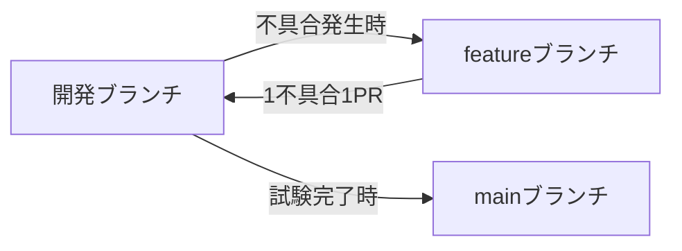
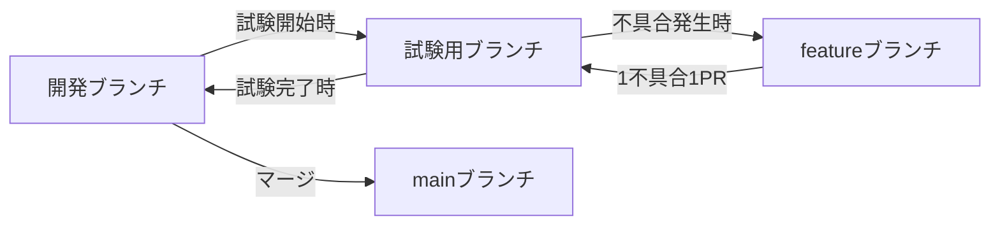

# 開発環境書

## 改訂履歴

| 版数 | 日付 | 内容 |
|---|---|---|
| 1.0 | 2026-08-16 | 初版作成 |
| 1.1 | 2026-08-16 | 0章の他ドキュメント参照文を削除し、代わりに1章「関連ドキュメント一覧」を新設。旧2章「ビルド/マージ」の手順4・5を具体化し、手順4の後に「プロンプトでレビューを行う」手順を追加（章番号を1つずつ繰り下げ） |
| 1.2 | 2026-08-16 | 3章「ビルド/マージ」の手順7（プルリクエストをマージする）を削除。ブランチ運用を扱う5章「リポジトリ管理」を新設 |
| 1.3 | 2026-08-16 | 3章手順4を、画面名等の設計内容に依存しない汎用的な表現に変更。手順6をTestFlightでの動作確認からPackage.swiftのbundleIdentifier/teamIdentifier確認に変更。4.1章の同内容の記述との重複を、3章手順6を実体・4.1章を参照とする形で整理 |
| 1.4 | 2026-08-16 | 3章のタイトルを「ビルド/マージ」から「ビルド」に変更し、ビルド成功をもって本章完了とする旨を末尾に追記。4.1章の「3章手順6にて実施となる」を「実施済み」に修正 |

## 0. 本書について

本書は、本プロジェクト（Sample App）の開発者・試験担当者向けに、開発環境の構築方法・ビルドからマージまでの流れ・E2E試験環境の構築方法をまとめた運用手順書である。

## 1. 関連ドキュメント一覧

本プロジェクトには、本書以外にも以下のドキュメントがある。それぞれの役割は次の通り。

| ドキュメント | 内容 |
|---|---|
| `docs/design/要件定義書.md` | アプリが何であるか（要件）を定義する一次情報 |
| `docs/design/PS設計書.md` | 内部処理仕様（状態遷移・通信フォーマット・クラス構成） |
| `docs/design/SS設計書.md` | 画面仕様（ボタン操作・ダイアログ文言・処理順序） |
| `docs/design/UI設計書.md` | 画面レイアウト |
| `docs/コーディング規約.md` | ソースコードの命名規則・アーキテクチャ方針・ファイル構成ルール |
| `docs/操作説明書.md` | エンドユーザー向けの操作手順 |
| `docs/レビュー観点.md` | コード・設計書をレビューする際にAIが用いる役割・観点の基準 |
| `docs/開発環境書.md` | 本書。開発環境構築・ビルド・E2E試験環境・リポジトリ管理の手順 |
| `CLAUDE.md`（リポジトリ直下） | AIセッションが作業開始時に参照する永続的な指示ファイル |

## 2. 開発環境

### 2.1 必要なもの

- デバイス（iPad等。対応デバイスの詳細は要件定義書1.2「開発環境」を参照）
- Claude Proプランの契約
- Apple Developer Programの契約

> 契約者名・アカウント情報等の個人情報は、本書には記載しない。

### 2.2 構築手順

1. **アプリをインストールする**
   - Swift Playgrounds（App Storeから入手）
   - Working Copy（App Storeから入手。GitHubリポジトリをiPad上にクローンするために使用する）
2. **GitHubでリポジトリを作成する**
   - リポジトリは公開（Public）にはせず、非公開（Private）で作成する
   - アクセス管理はトークンキー（Personal Access Token等）を用いて行い、閲覧者（Read）と変更者（Write）を分けて管理する

## 3. ビルド

通常の開発サイクルは、以下の手順で行う。

1. **Claude Code on the webでコードを生成し、コミットする**
2. **Working CopyでiPadにリポジトリをクローンし、対象のブランチに切り替える**
3. **Swift Playgroundsでビルドを行う**
   - エラーまたは警告が発生した場合は、画面のキャプチャを撮り、Claudeへ提示して修正案を提案させる
   - 修正は承認後にのみ実装・修正させる（無断で修正させない。詳細な運用方針はCLAUDE.md2章「変更の進め方に関する運用ルール」を参照）
4. **Swift Playgroundsのプレビューで動作確認を行う**
   - プレビュー上で、画面遷移・表示内容が設計書（SS設計書・UI設計書）通りかを確認する
   - 実機の通信相手がいない状態で先の画面まで確認したい場合は、プレビュー確認用のデバッグ機能（PS設計書 付録A参照）を活用してもよい
   - Bluetooth通信そのもの（実機2台間の実際の送受信）はプレビューでは確認できないため、4章「E2E試験環境」の手順に委ねる
5. **プロンプトでレビューを行う**
   - Claude Code on the webのプロンプトで、今回の変更内容のレビューを依頼する
   - レビューは`docs/レビュー観点.md`に定めた役割・観点に基づいて行わせる
   - 指摘があった場合は内容を確認し、修正が必要と判断したものだけを依頼する（指摘＝即修正ではない）
6. **Package.swiftのbundleIdentifier・teamIdentifierが、正式な値に設定されていることを確認する**

上記の手順を経て、Swift Playgroundsでのビルドが成功した時点で、本章の作業は完了とする。

## 4. E2E試験環境

E2E試験は、TestFlight経由で実機2台にアプリを配布し、`docs/操作説明書.md`に沿って実施する。以下、TestFlightで配布可能にするための手順を、App Store Connectでの新規App追加から記載する。

> Apple側の管理画面（App Store Connect／Apple Developer）は、UIやメニューの配置が随時変更される。以下は手順の大枠であり、実施時点の画面と差異がある場合は、Appleの公式ドキュメント（developer.apple.com）で最新の手順を確認すること。

### 4.1 前提

- Apple Developer Programへの登録が完了していること（登録には数日かかる場合がある）
- `Package.swift`の`bundleIdentifier`・`teamIdentifier`が、正式な値に設定されていること（3章手順6にて実施済み）

### 4.2 App IDの登録（Apple Developerサイト）

1. [developer.apple.com](https://developer.apple.com)にログインし、「Certificates, Identifiers & Profiles」を開く
2. 「Identifiers」から新規App IDを登録する
   - Bundle ID：`Package.swift`の`bundleIdentifier`と一致させる（Explicit指定）
   - 使用するCapability（本アプリの場合はBluetooth関連の権限）を有効にする

### 4.3 証明書・プロビジョニングプロファイル

1. 同じく「Certificates, Identifiers & Profiles」で、配布用（Distribution）証明書を作成・取得する
2. 4.2で登録したApp IDに対応する、App Store配布用のプロビジョニングプロファイルを作成する
3. Swift Playgroundsで自動署名（Automatic Signing）が利用できる場合は、Apple Developerアカウントでサインインするだけで証明書・プロファイルが自動的に管理されることが多い。自動署名が使えない場合のみ、手動で上記の証明書・プロファイルを紐づける

### 4.4 App Store Connectでの新規App追加

1. [appstoreconnect.apple.com](https://appstoreconnect.apple.com)にログインする
2. 「マイApp」→「＋」→「新規App」を選択する
3. 以下を入力する
   - プラットフォーム：iOS
   - App名
   - プライマリ言語
   - Bundle ID：4.2で登録したものを選択する
   - SKU：任意の一意な文字列（管理用の内部識別子であり、ユーザーには表示されない）

### 4.5 ビルドのアップロード

1. Swift Playgroundsから、TestFlight配布用にアプリをビルドし、App Store Connectへアップロードする
2. App Store ConnectのTestFlightタブで、アップロードしたビルドの処理が完了する（数分〜数十分かかる場合がある）のを待つ

### 4.6 テスターの登録と配布

1. TestFlightタブで「内部テスト（Internal Testing）」グループを作成する
2. E2E試験を行う実機2台分のApple IDを、テスターとして追加する
3. 各テスターの端末でTestFlightアプリをインストールし、招待を受諾してアプリをインストールする

### 4.7 E2E試験の実施・記録

- `docs/操作説明書.md`の手順に沿って、実機2台で実際に操作しながら確認する
- 検出した不具合・確認結果は`E2E試験結果.md`に記録する（要件定義書13章「開発ドキュメント方針」を参照）

## 5. リポジトリ管理

本プロジェクトはテストコードを使用しない方針（要件定義書13章参照）のため、ブランチ運用は以下の通りとする。将来テストコードを導入する場合は、5.2の運用に切り替える。

- `main`ブランチ：最終成果物
- 開発ブランチ：現在使用しているブランチ。ブランチ名はセッションごとに自動生成される（例：`claude/xxx-xxxxx`）ため、本書では固定のブランチ名は記載しない

### 5.1 現状の運用（テストコードを使用しない場合）

開発と試験は、同じ開発ブランチ上で行う。

1. 開発ブランチ上で開発を進める（3章「ビルド」の手順に従う）
2. 不具合が発生した場合は、開発ブランチから`feature`ブランチを作成する
3. 1不具合につき1プルリクエストで、`feature`ブランチから開発ブランチへマージする
4. 試験（4章「E2E試験環境」）が完了したら、開発ブランチを`main`ブランチへマージする

### 5.2 将来の運用（試験でテストコードを用いる場合）

開発ブランチと試験を分離する。

1. 開発ブランチ上で開発を進める
2. 開発ブランチから、試験専用のブランチ（試験用ブランチ）を作成する
3. 試験用ブランチで試験中に不具合が発生した場合は、試験用ブランチから`feature`ブランチを作成する
4. 1不具合につき1プルリクエストで、`feature`ブランチから試験用ブランチへマージする
5. 試験が完了したら、試験用ブランチを開発ブランチへマージする
6. その後、開発ブランチを`main`ブランチへマージする

